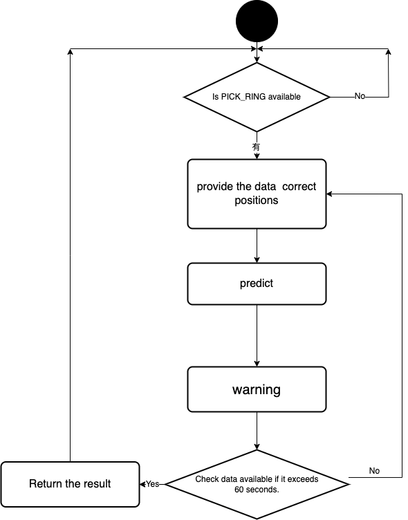

# EEW (Earthquake Early Warning) Model on Earthworm System


## Introduction to Earthworm System
The **Earthworm system** is a well-known open-source seismic acquisition and processing system. It is widely used for real-time earthquake monitoring, providing essential data for early warning systems by capturing and processing seismic wave information from various stations.

## Overview
This system is designed to receive seismic wave information from the Earthworm system for earthquake early warning. The **EEW model** is utilized to generate the warnings.

## Introduction

We follow the workflow outlined in the diagram below:

1. Confirm if there is data in the **PICK RING**.
2. Preprocess the data based on the configuration of the EEW model.
3. Perform early warning calculations.
4. Issue the warning.
5. Repeat steps 1-5 every 60 seconds.
6. Return the results.

* <a href=""></a>

## Install & Run

- Download the EEW Model checkpoint: [here](https://drive.google.com/file/d/1leZ15WJegQ_ibTYY24PcTKo_1m1RtCX1/view?usp=sharing)
- Please ensure that the Earthworm system is installed and that the **PICK module** is properly configured. The PICK module should be writing picking data into **PICKRING**.

```sh
$ git clone https://github.com/skysora/earthworm_predict
$ cd ./earthworm_predict
$ python3 EEW_new.py
